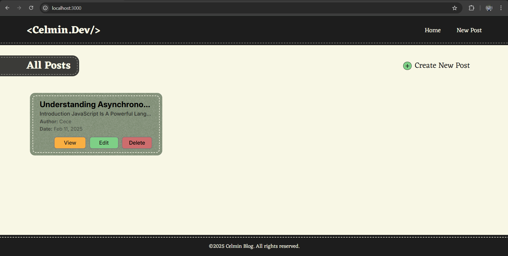
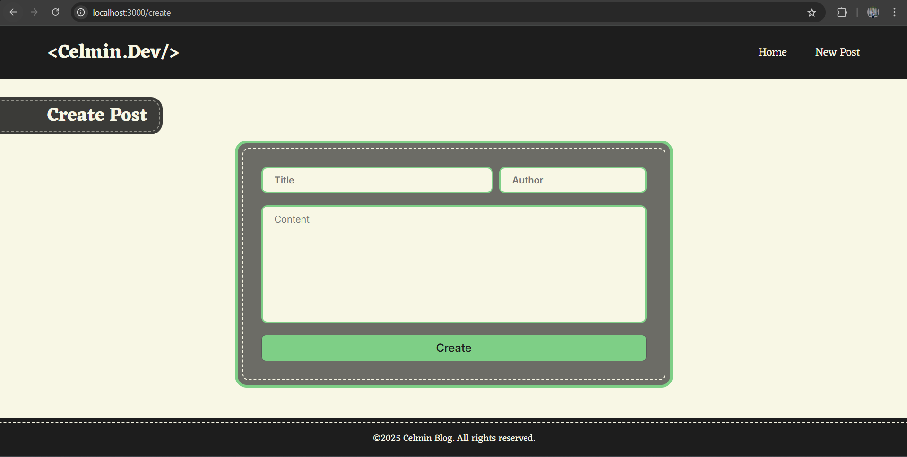
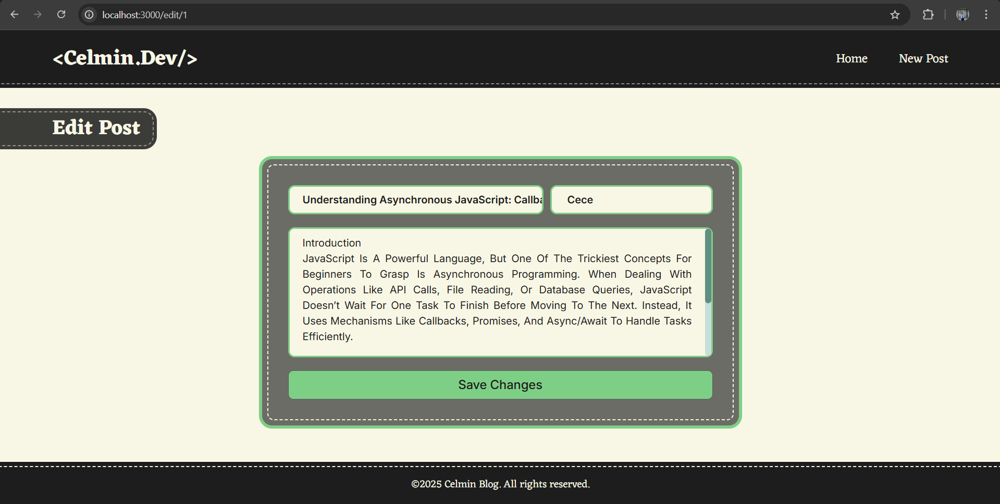
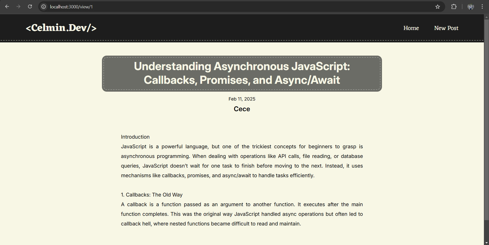
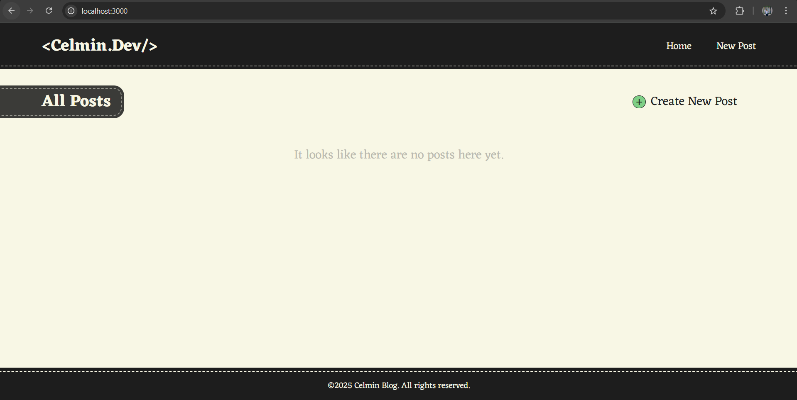

# 🌟 Blog Web Application
A simple blog web application built with Node.JS, Express.JS and EJS that allows users to **create**, **view**, **edit**, and **delete** posts.

## ✨ Features
- **Post Creation**: Users should be able to create new posts.
- **Post Viewing**: The home page should allow the user to view all their posts.
- **Post Update/Delete**: Users can be edit and delete posts.


## 💻 Tech Stack
- Node.js: JavaScript runtime used to build the server-side logic.
- Express.js: Web framework for Node.js, used to create the server, handle HTTP requests, define routes, and manage middleware.
- EJS: Templating engine for rendering dynamic HTML content.


## 🚀 Getting Started
### 1️⃣ Clone the Repository
```bash
https://github.com/clmnshn28/Blog-Web-App.git
cd Blog-Web-App
```
### 2️⃣ Install Dependencies
```bash
npm install
```
### 3️⃣ Run the Server
➤ Option 1: Run Normally
``` bash
node index.js
```
➤ Option 2: Use Nodemon for Auto-Restart on Changes
If you want the server to restart automatically when you make changes, install nodemon globally:
```bash
npm install -g nodemon
```
Then start the serve with:
```bash
nodemon index.js

```

*The application will be running at: http://localhost:3000 🌍*

## 👀 Overview












## 🤝 Contributing
Contributions are welcome! If you have suggestions for improvements or new features, please create an issue or submit a pull request.

## 🪪 License
This project is open-source and available under the MIT License.

💡 Let's build something awesome together! 🚀

